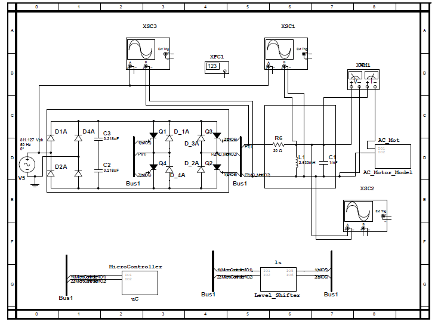

# Two-Stage-Frequency-Converter
Here, a two stage frequency converter is designed so as to control speed of an induction motor. Multisim Simulation software is used for simulation. MPLAB IDE was used for writing the header and C programs for the PIC microcontroller. The microcontroller is used to trigger the GTOs (Gate Turn Off) sequentially. GTO
## Steps to access the simulation
> - Open '*TestCYCLO_MainFile.ms12*' 
> - Double Click on the microcontroller box 
> - Click on '*Open subsheet*'
> - Double Click on the **PIC16F84A**
> - Click on the *Code Tab*
> - Click on *Properties*
> - Click on *Project1*
> - Click on *Browse*
> - Go to the path '*New.X\dist\default\production*' 
> - Then select the **.hex** file
> - Press *ok* then enjoy simulating!!

## Two Stage Converter Block Diagram 

